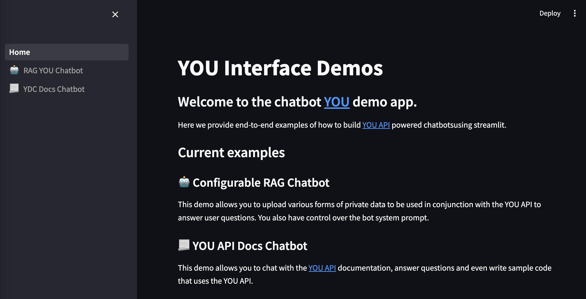
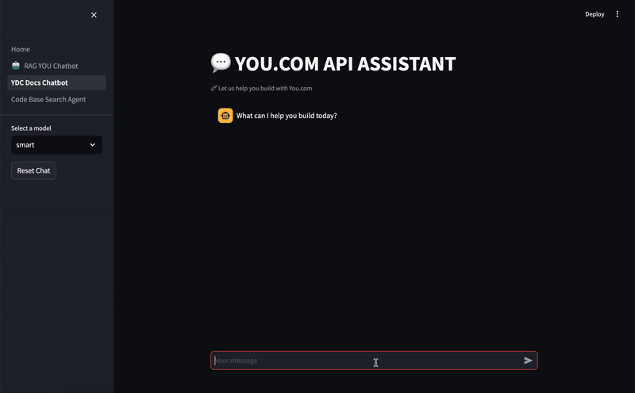

# API Chatbot Demo
# Set Up

1. Environment management options
  ```poetry shell```

2. Install package
```
poetry install
```

3. Create private environment file (this will/should not be committed!)
```
cp .env-template .env
```

Add the `OPENAI_API_KEY` & `YDC_API_KEY` API keys to `.env`.

1. Check installation worked by running 
```
poetry run pytest .
```

Note: To pass all tests, an `OPENAI_API_KEY` & `YDC_API_KEY` must be added to `.env`.

# Demos
Run `make demo` to see the main demo interface.
You should see something like:
```
poetry run streamlit run interfaces/Home.py

  You can now view your Streamlit app in your browser.

  Local URL: http://localhost:8000
  Network URL: http://XXX.XXX.X.XX:8000
```
And after clicking the link above, should see something like this:


# Deploy and Share
To easily share this demo with others, you can use [streamlit-cloud](https://streamlit.io/cloud).
[Here is](https://rodrigo-georgian-ai-interface-example-interfaceshome-rj9c7e.streamlit.app/) a host example of the default app created by this repo.

## Available Demos

### 🤖 Configurable RAG Chatbot
    
This demo allows you to upload various forms of private data to be used in conjunction with the YOU API to 
answer user questions. You also have control over the bot system prompt.


### 📃 YOU API Docs Chatbot

This demo allows you to chat with the [YOU API](https://api.you.com/) documentation, answer questions and even
write sample code that uses the YOU API.



# Repo Info
## Poetry
We use [poetry](https://python-poetry.org/) as our dependency manager.
The link above has great documentation but there is a TL;DR.

- Install the package: `poetry install`
- Add a dependency: `poetry add <python-lib>`
- Where are dependencies specified? `pyproject.toml` include the high level requirements. The latests exact versions installed are in `poetry.lock`.

## Streamlit
We use [streamlit](https://streamlit.io/) for the interface. 

Streamlit is an open-source Python library that makes it easy to create and share custom web apps for machine learning and data science. 

Here are [the docs](https://docs.streamlit.io/).
